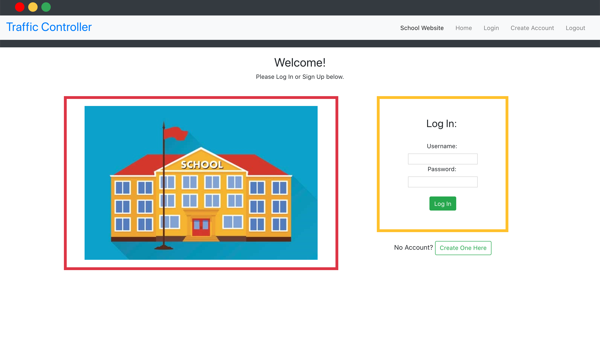

https://traffic-report-app.herokuapp.com/
# Red Light, Green Light: A "Traffic Report" for Teachers to Track Students' Understanding.
## About
Before becoming a software developer, I served as a high school math teacher for many years. One fall, I decided to try an experiment: I'd ask my students to move a magnet into one of three columns as they left the classroom each day. A magnet in the GREEN column would signify feeling good about the day's lesson, comfortable with what we'd learned and ready to move on. Placement in the YELLOW column represented some hesitation and lingering uncertainty about the material. And RED denoted total confusion or frustation and a desire to recap or review.
The kids were into it -  and I was thrilled to be able to get daily check-ins of a sort. But by week 3 of school, all the magnets had disappeared. **sigh

Enter Traffic Report. This website aims to gather data from students about their fluctuating levels of understanding in order to provide teachers with useful data. Graphical representations of the data allow teachers to visualize trends, track a student's progress, and adjust lessons accordingly. Students and teachers alike can also keep track of assignments, announcements, and questions relating to each of their courses.

## Features
An extension for a school's online learning platform, Traffic Report not only serves as a place for students to check their nightly homework, keep up with class announcements, and ask questions in real-time; it also prompts them to click Red, Yellow, or Green to signify their understanding of, and comfort with, the current material. 
Teachers can track this data -- looking at weekly averages, noting when many students seem confused, and keeping an eye on any students who may consistently be answering 'Red'.  

## Try it Yourself
Traffic Report is hosted live on Heroku.com at this link: [https://traffic-report-app.herokuapp.com/](https://traffic-report-app.herokuapp.com/). Head on over and check it out!

## Video Tutorial 
Coming Soon!

## Slides and Images 
<b>Welcome to Stellar:</b>
<br /> <br>

<br><br>
<b>User Calendar w/ Option to Add Events:</b>
<br />

<br><br>
<b>My Events Page:</b>
<br />

<br><br> 
<b>Moon Phase Example:</b>
<br />

<br><br> 
<b>Constellation Detail:</b>
<br />

<br><br> 

## Installing Locally
 - If you'd like to clone down this project repository to your local computer, you can do so by forking it, then hitting the "Clone or download" button. Copy the SSH link, and open up your computer's Terminal. Inside, type "git clone <the link you've just copied>". 
 ```
   git clone <example: git@github.com:.../Traffic_Report_Frontend.git></example:>
  ```
 - You'll also need to fork and clone down the <a href="[Backend](https://github.com/clheard54/Traffic-Report-Backend)">backend</a> repo for this project. You can find the link here: [Backend](https://github.com/clheard54/Traffic-Report-Backend). Follow the same steps as above.

 - Back in your terminal, type "bundle install".
  ```
   bundle install
  ```
 - Then, from the root directory, run "rake db:create" and "rake:db:migrate" to create the database locally.
  ```
   rake db:create && db:migrate
  ```
 - Lastly, run "rake db:seed". Now you're ready to go!
  ```
   rake db:seed
  ```

To open the app, you'll have to start up a local server. In your terminal, navigate to the backend api directory and then type "rails s".
 ```
 rails s
 ```
- Since you've already forked and cloned down the [Frontend](https://github.com/clheard54/Traffic_Report_Frontend), you can navigate straight to its root directory in your termail and type the following commands:
 ```
npm install
npm start
 ```
- Sign up for a new account, start exploring, and enjoy!

## Technologies Used 
- Ruby on Rails (API)
- ActiveRecord, Postgresql
- JavaScript 
- React & Redux

## Authors
Created by Clarion Heard.

## Contributing 
Contributions are welcome. Submit a pull request!

## Acknowledgements

## License 
This project is licensed under the GNU GPL (https://www.gnu.org/licenses/gpl-3.0.en.html)
    Copyright (C) <2020>  <Clarion Heard>
    This program is free software: you can redistribute it and/or modify it under the terms of the GNU General Public License as published by the Free Software Foundation, either version 3 of the License, or (at your option) any later version.
    This program is distributed in the hope that it will be useful,
    but WITHOUT ANY WARRANTY; without even the implied warranty of
    MERCHANTABILITY or FITNESS FOR A PARTICULAR PURPOSE.  See the
    GNU General Public License for more details.
    You should have received a copy of the GNU General Public License along with this program.  If not, see <https://www.gnu.org/licenses/>.


This project was bootstrapped with [Create React App](https://github.com/facebook/create-react-app).